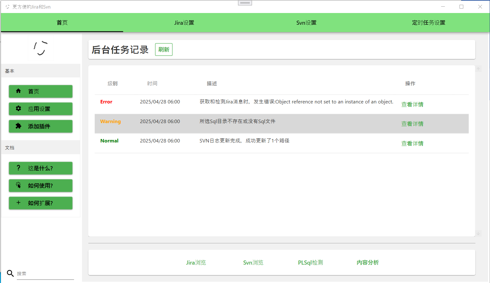
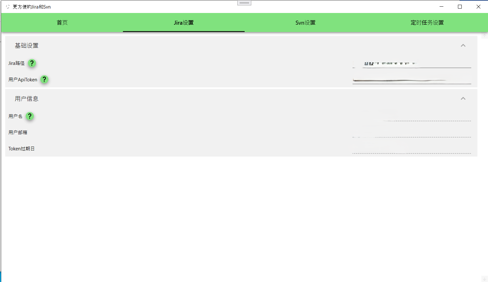
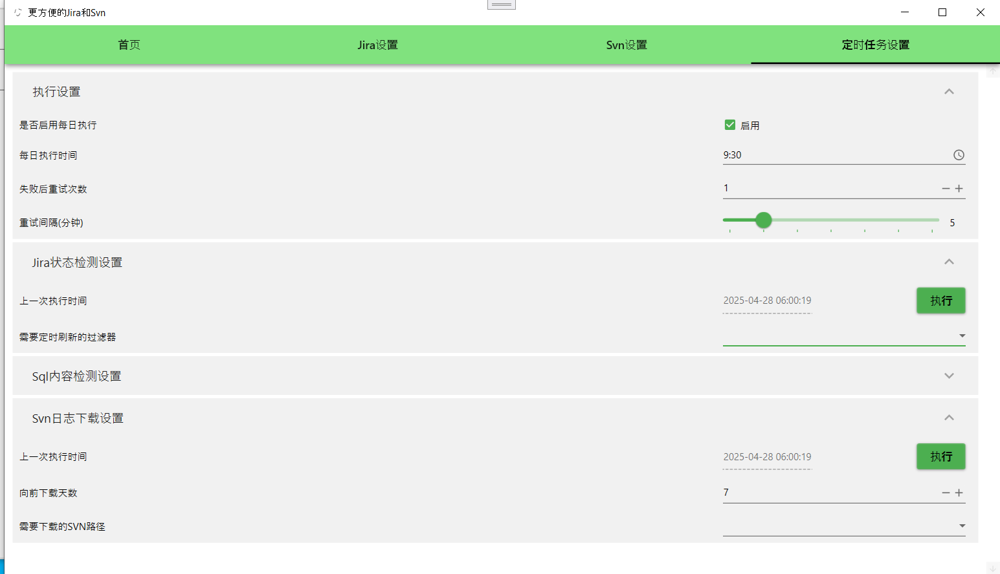
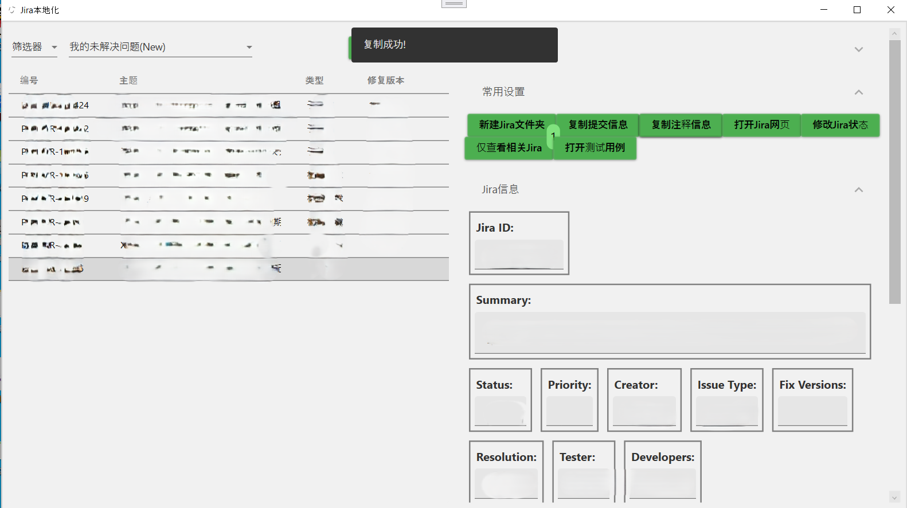
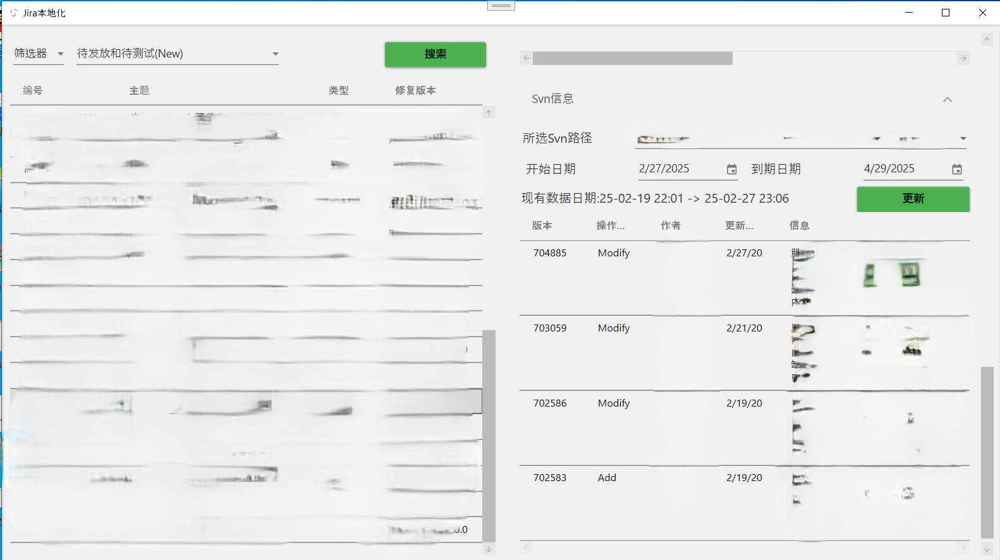
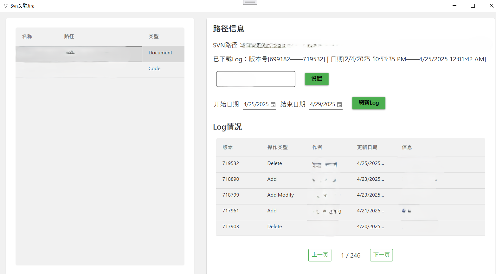
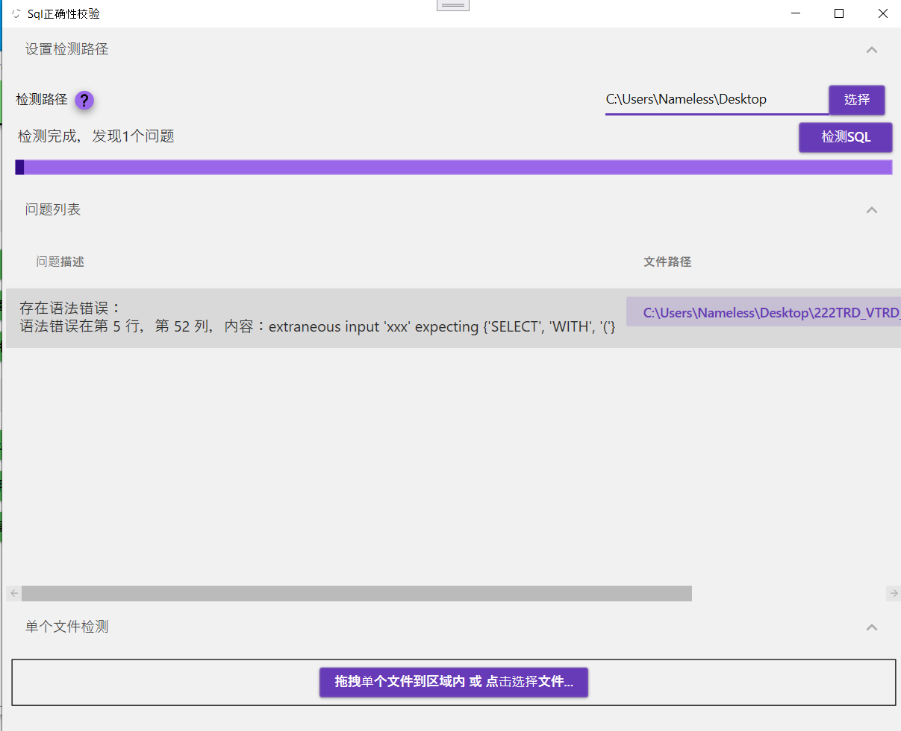

# MoreConvenientJiraSvn

## 简介  
一个基于使用 WPF(.net core 8.0) 开发的客户端软件，旨在帮助用户整合浏览与操作 Jira/Svn 的流程。

假如你所在的团队同时在使用 Jira 和 Svn，但没有启用 Subversion ALM 或者别的类似插件，这或许是个有帮助的工具。

## 特性  
- 查看 Jira 问题
- 查看 SVN 日志  
- 综合以上两者，提供查询Jira时显示相关的Svn日志（需要预先配置）
- 一些常用的小功能，例如：
1. 为每个Jira问题创建本地文件夹，根据问题的内容设置好文档模板和下载附件。
2. 验证某个文件夹下的Sql脚本是否合法（目前仅支持PLSQL）。
3. 一些定时任务，例如每日下载Svn日志到本地，检测某个Jira问题筛选器里的问题是否有需要关注的变动。

## 安装  
1. 从 [发行页面](https://github.com/MinerZHANGZHANG/MoreConvenientJiraSvn/releases) 下载最新版本的安装包。  
2. 解压后，运行MCJS/MoreConvenientJiraSvn.App.exe。  

## 页面介绍   
1. 首页  
- 上方提供四个Tab页面，除第一个首页外，另外三个用于配置程序
- 中间用于显示后台任务的记录。
- 下方提供四个按钮，用于打开不同的功能窗体。

2. 设置Jira和Svn信息  
- 主页的后三个Tab页面用于配置程序。  
- 例如下图通过配置Jira地址和用户ApiToken，以在其它界面查询Issue信息。  
- 这些信息会存在安装路径下的litedb.db文件中，请妥善保存它。  

   

3. 后台任务配置  
- 程序提供了一些定时的后台任务，如更新程序保存的Svn日志，校验某个文件夹的Sql是否合法等。
- 可以在首页上方第四个Tab页进行启用和配置。

  
4. Jira问题浏览相关功能   
- 在主界面下方的四个按钮中，第一个"Jira浏览"可打开这个窗体。
- 左侧上方头部支持三种模式查询Jira问题信息，包括问题编号，JQL和筛选器（会自动查询当前用户收藏的筛选器）。
- 左侧会显示Jira编号和主题。
- 右侧是一些Jira操作常用功能，如在特定目录（可在上方配置）创建一个存放Jira信息的文件夹。
- 其中"修改Jira状态"按钮，支持打开提交表单填写内容，变更Jira问题状态。

  **根据不同的Jira环境，或许需要修改代码以使得这些功能符合你的使用场景**

- 此外，如果配置了Jira问题版本关联的Svn路径，并下载了日志，可以在下方查看这个Jira相关的日志。

5. Svn日志下载功能

- 在主界面下方的四个按钮中，第二个"SVN浏览"可打开这个窗体。
- 左侧为在首页第三个Tab页"SVN设置"里添加的SVN路径。
- 右侧可浏览和下载一定时间区间内的SVN路径里的日志。
- 可设置这个SVN路径关联的Jira版本，以在Jira问题浏览界面关联相关的SVN日志。

6. SQL语法校验

- 在主界面下方的四个按钮中，第三个"SVN浏览"可打开这个窗体。
- 支持选择文件夹或单个文件校验是否存在语法错误。
- 目前只支持Oracle的PLSQL校验。

## 待完成的内容  

- [ ] 完善提交Jira问题功能，支持使用本地的信息填充提交内容。
- [ ] 增加使用和开发文档。
- [ ] 修改外观，尤其是配色需要更正常点。
- [ ] 支持对接llm分析代码和生成文档信息。
- [ ] 提取Jira Issue信息中自定义字段改为可配置。
- [ ] 本地化支持。

## 第三方Nuget引用

> [MaterialDesignInXAML(5.1.1-ci753)](https://github.com/MaterialDesignInXAML)

> [LiteDB(5.0.21)](https://www.litedb.org/)

> [SharpSvn(1.14003.290)](https://github.com/AmpScm/SharpSvn/)

> [CommunityToolkit.Mvvm(8.3.2)](https://github.com/CommunityToolkit/dotnet)

> [AngleSharp(1.2.0)](https://anglesharp.github.io/)

> [Antlr4(4.13.1)](https://github.com/antlr/antlr4)

> [MdXaml(1.27.0)](https://github.com/whistyun/MdXaml)

> [Serilog(4.2.0)](https://serilog.net/)

> [NUnit(4.0.1)](https://nunit.org/)
