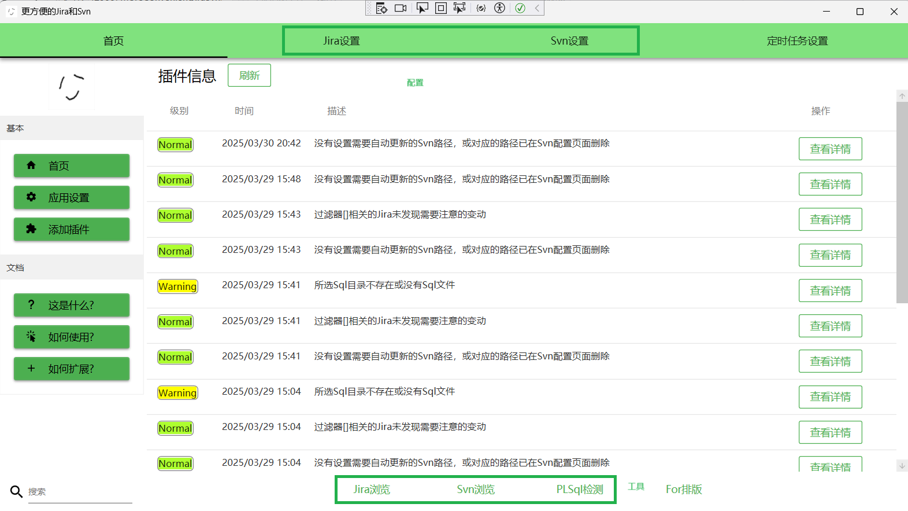

# MoreConvenientJiraSvn

## 简介  
一个基于使用 WPF(.net core 8.0) 开发的客户端软件，旨在帮助用户整合浏览与操作 Jira/Svn 的流程。

假如你所在的团队同时在使用 Jira 和 Svn，但没有启用 Subversion ALM 或者别的类似插件，这或许是个有帮助的工具。

## 特性  
- 查看 Jira 问题
- 查看 SVN 日志  
- 综合以上两者，提供查询Jira时显示相关的Svn日志（需要预先配置）
- 一些常用的小功能，例如：
1. 为每个Jira问题创建本地文件夹，根据问题的内容设置好文档模板和下载附件。
2. 验证某个文件夹下的Sql脚本是否合法（目前仅支持PLSQL）。
3. 一些定时任务，例如每日下载Svn日志到本地，检测某个Jira问题筛选器里的问题是否有需要关注的变动。

## 安装  
1. 从 [发行页面](https://github.com/MinerZHANGZHANG/MoreConvenientJiraSvn/releases) 下载最新版本的安装包。  
2. 解压后，运行MCJS/MoreConvenientJiraSvn.App.exe。  

## 用法   
1. 首页上方切换到配置页面，设置Jira和Svn信息（这些信息会存在安装路径下的litedb.db文件中，请妥善保存它）。  
2. 首页下方可以跳转到各个工具进行使用

。  

## 待完成的内容  
- 完善提交Jira问题功能，支持使用本地的信息填充提交内容。
- 增加使用和开发文档。
- 修改外观，尤其是配色需要更正常点。
- 本地化支持。
